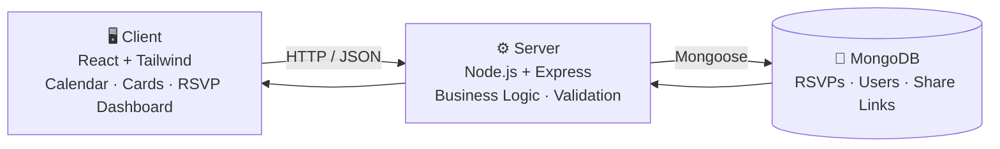
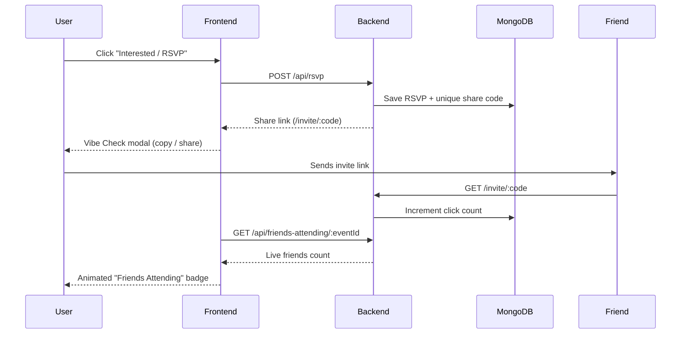

<div align="center">

# ⚡ Vibe Events

### Intelligent Event Finding & Tracking Platform

*Find events. RSVP instantly. Vibe with friends.*


A full-stack event discovery, RSVP tracking and friend-invitation platform, built for the **Quantiphi Vibe Coding Round**.

</div>

---

## 📖 Table of Contents

- [Overview](#-overview)
- [Key Features](#-key-features)
- [Tech Stack](#-tech-stack)
- [System Architecture](#-system-architecture)
- [The Vibe Check Flow](#-the-vibe-check-flow)
- [Getting Started](#-getting-started)
- [API Endpoints](#-api-endpoints)
- [Project Structure](#-project-structure)
- [Design Decisions](#-design-decisions)
- [Future Improvements](#-future-improvements)

---

## 🌟 Overview

**Vibe Events** lets users discover local events, mark their interest (RSVP), and invite friends through a unique **Share Link**. The backend tracks every click on that link and serves a live **"Friends Attending"** count on the event card.

All business logic, validation and calculations live on the **server**. The frontend focuses purely on presentation and user interaction.

---

## ✨ Key Features

### 🎨 Frontend UI & User Interaction

| Feature | Description |
|---|---|
| 📅 **Event Calendar** | Interactive monthly grid that highlights dates with local events. Click a date to filter. |
| 🃏 **Event Cards** | Title, venue, city, date, time, category and an **Interested / RSVP** button. |
| 🏷️ **Dynamic Badges** | `Trending` and `Vibe Check Active` badges update based on event state. |
| 🔍 **Search & Filters** | Instant keyword search plus category pills: `All`, `Tech`, `Music`, `AI/Cloud`. |
| 📊 **RSVP Dashboard** | Live view of confirmed events with analytics: Total RSVPs, Invites Sent, Friends Attending. |
| 🔗 **Vibe Check Modal** | After RSVP: unique invite link, copy-to-clipboard, WhatsApp share and an animated live friends counter. |
| 🌌 **Glassmorphism Dark UI** | Neon indigo, purple and emerald gradients with blur effects and glowing hover states. |
| 📴 **Graceful Fallback** | If the API is down, the UI switches to demo mode with mock data and shows a status indicator. |

### ⚙️ Backend Logic & State Management

- **Event Feed**: serves event listings through `GET /api/events`.
- **Persistence**: MongoDB (Mongoose) stores RSVPs, user profile details and event reminder settings.
- **Vibe Check (Friend Invite System)**:
  - Generates a unique share code and link (`/invite/:code`) when a user RSVPs.
  - Tracks how many users clicked each link (server-side).
  - Returns real-time **Friends Attending** counts for event cards.

---

## 🛠️ Tech Stack

| Layer | Technology |
|---|---|
| **Frontend** | React 18 (UMD), Tailwind CSS (CDN), Font Awesome, HTML5 |
| **Backend** | Node.js, Express.js |
| **Database** | MongoDB with Mongoose ODM |
| **Architecture** | Server-side business logic with a decoupled presentation layer |

---

## 🏛️ System Architecture



---

## 🔗 The Vibe Check Flow



---

## 🚀 Getting Started

### Prerequisites

- [Node.js](https://nodejs.org/) v18 or v20+
- npm
- MongoDB (local instance or [MongoDB Atlas](https://www.mongodb.com/atlas))

### 1️⃣ Clone the repository

```bash
git clone https://github.com/yash-D-Dalavi/event-tracker-app.git
cd event-tracker-app
```

### 2️⃣ Backend setup

```bash
cd server
npm install
node index.js
```

The server runs on **http://localhost:5000**

### 3️⃣ Frontend setup

Open `client/index.html` directly in any browser, or serve it with VS Code **Live Server**.

> 💡 If the backend is offline, the UI automatically falls back to mock data (look for the **"Demo mode"** badge in the header).

---

## 📡 API Endpoints

| Method | Endpoint | Description |
|:---:|---|---|
| `GET` | `/api/events` | Fetch all local event listings |
| `POST` | `/api/rsvp` | Submit an RSVP and generate a unique share link |
| `GET` | `/invite/:code` | Track a share-link click (Vibe Check) |
| `GET` | `/api/friends-attending/:eventId` | Fetch friends-attending count and click metrics |

### Sample request: `POST /api/rsvp`

```json
{
  "eventId": "1",
  "userId": "u_abc123",
  "shareCode": "k9x2pq"
}
```

---

## 📁 Project Structure

```text
event-tracker-app/
├── client/
│   └── index.html        # Single-file React + Tailwind UI
├── server/
│   ├── index.js          # Express entry point
│   ├── package.json
│   └── ...               # Routes, models, controllers
└── README.md
```

---

## 🧠 Design Decisions

- **Server-side logic**: validations, share-code generation and click counting are handled by the backend; the UI only renders and interacts.
- **Resilient frontend**: API calls use timeouts with automatic fallback, so the app never shows a blank screen.
- **Single-file client**: zero build step, so it is easy to run, review and demo.
- **Accessible UI**: keyboard-friendly modal (`Esc` to close), aria labels and responsive layout.

---

## 🔮 Future Improvements

- 🔐 User authentication and profile management
- ⏰ Email / push event reminders
- 🌍 Location-based event discovery
- 💬 Real-time updates through WebSockets
- 🧪 Unit and integration test coverage

---

<div align="center">

**Built with ❤️ by [Yash Dalavi](https://github.com/yash-D-Dalavi)**

⭐ If you like this project, give it a star!

</div>
